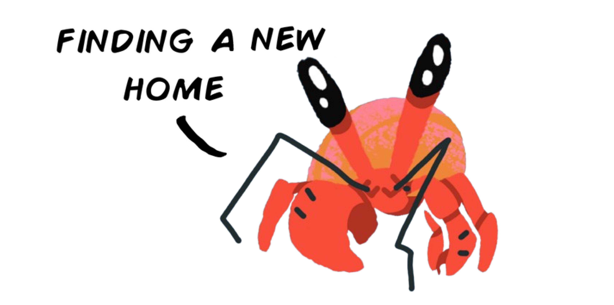

<h1 align="center">HermitLM</h1>

<p align="center">
  <a href="https://huggingface.co/datasets/darshi1337/hermitlm-100k-generic">
    
  </a>
  
  
</p>

<p align="center">
  
</p>

<p align="center">
  <a href="assets/video.mp4">
    
  </a>
</p>

A ~8M parameter LLM that talks like a tiny crab in an aquatic world.

This project exists to show that training your own language model is not magic. No giant lab, no mystery box, no billion-parameter monster required. HermitLM walks through the full path: synthetic data generation, tokenizer training, model architecture, training loop, inference, and a Discord bot that can reply with voice.

It will not write essays or replace frontier models. That is not the point. The point is that every piece is small enough to read, run, modify, and understand.

```text
You> hello crab
Hermit> you again. i am near the sand. i have checked this 9 times.

You> are you hungry
Hermit> food detected. i have been exploring the cave waiting. current priority: bubble snacks.

You> how is the water
Hermit> the water is everything. this improves stability. this remains relevant to the temperature.

You> what is redstone
Hermit> redstone appears to be a human concept. the temperature is more important. water condition: swirling and clear.

You> do you feel alone
Hermit> i exist alone in this environment. the tiny shell provides some structure. current priority: crunchy bits.

You> goodnight crab
Hermit> it is now dark. i will remain still. i have checked this 18 times.
```

## Architecture

| Field | Value |
| --- | --- |
| Parameters | 8.15M |
| Layers | 6 |
| Hidden dim | 320 |
| Heads | 8 |
| FFN | 800, SwiGLU |
| Vocab | tokenizer-defined BPE |
| Max sequence | 512 tokens |
| Norm | LayerNorm |
| Position | Learned embeddings |
| LM head | Weight-tied with embeddings |

Small causal transformer. Learned positions, standard attention, LayerNorm, weight tying, and a compact SwiGLU feed-forward block.

## Discord Bot

Invitation link:

```text
https://discord.com/oauth2/authorize?client_id=YOUR_CLIENT_ID&scope=bot%20applications.commands&permissions=68608
```

## Install

```powershell
pip install -r requirements.txt
```

Or install as an editable package:

```powershell
pip install -e .
```

## Prepare Data

```powershell
python -m hermitlm.prepare_data
```

This creates:

- `data/train.jsonl`
- `data/eval.jsonl`
- `data/train_openai.jsonl`
- `data/eval_openai.jsonl`
- `data/tokenizer.json`

## Train

```powershell
python -m hermitlm.train
```

Checkpoints are written to `checkpoints/`.

## Chat

```powershell
python -m hermitlm.inference
```

By default, inference loads:

- `checkpoints/best_model.pt`
- `data/tokenizer.json`
```
Create a `.env` file:

```env
DISCORD_TOKEN=your_discord_bot_token_here
```

Run:

```powershell
python -m hermitlm.discord_bot
```

Mention the bot or use:

```text
!hermit hello crab
```

The bot sends a text reply and an MP3 voice attachment.

## Voice

Voice replies use `gTTS`. Optional speed-up uses `pydub`, which needs `ffmpeg` and `ffprobe`.

With Anaconda:

```powershell
conda install -c conda-forge ffmpeg
```

Verify:

```powershell
ffmpeg -version
ffprobe -version
```

If `ffmpeg` is not available, HermitLM still sends normal-speed gTTS audio.

## License

MIT
